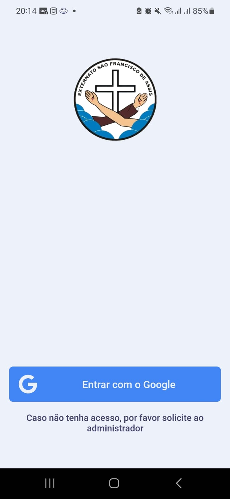
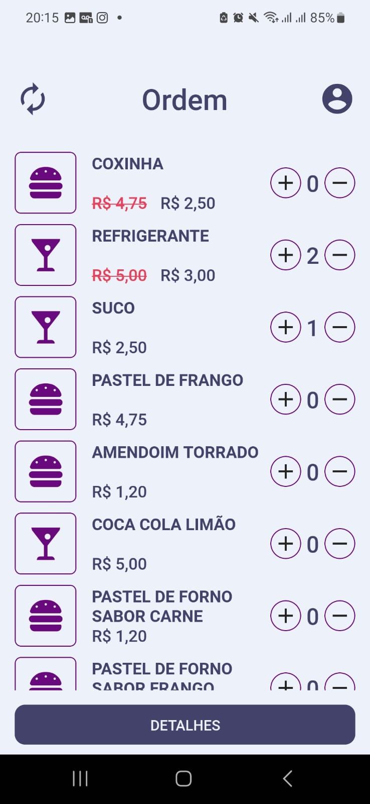
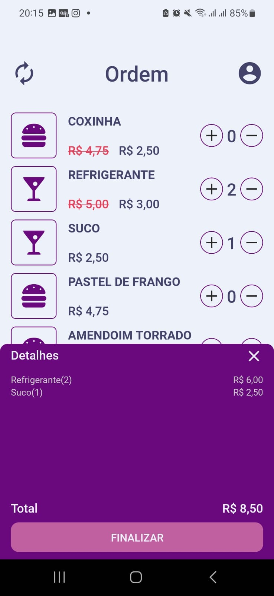
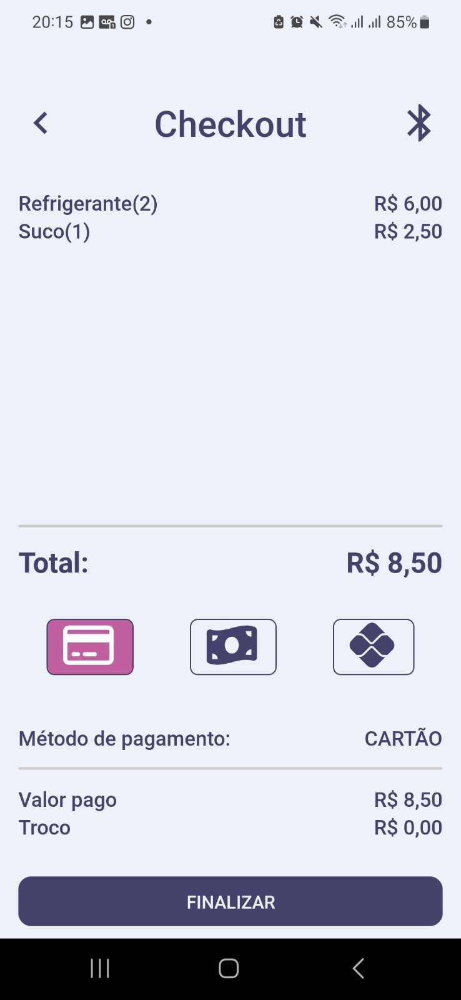
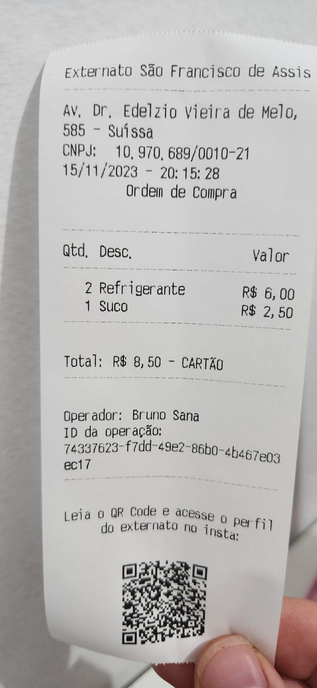
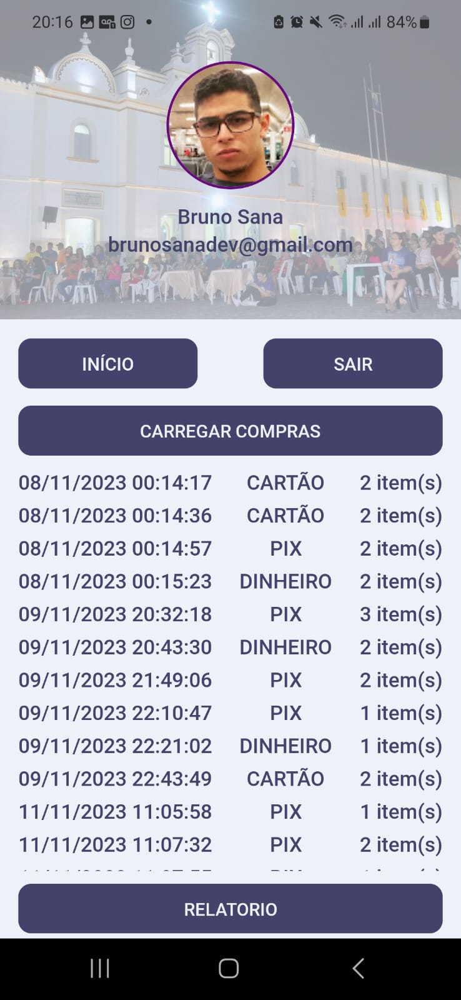
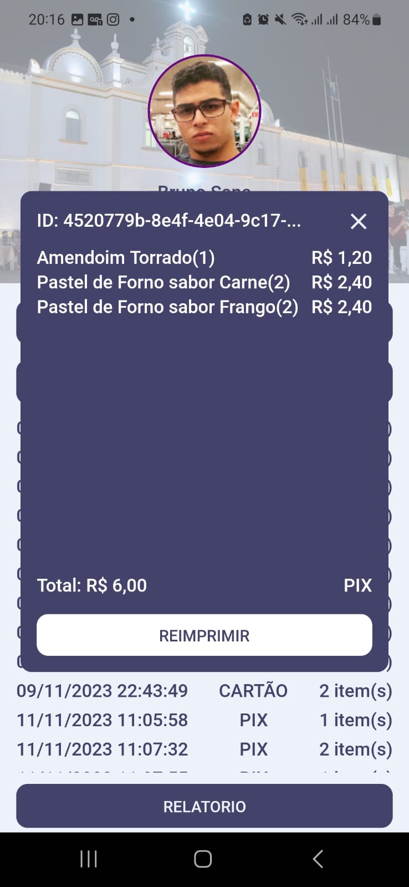
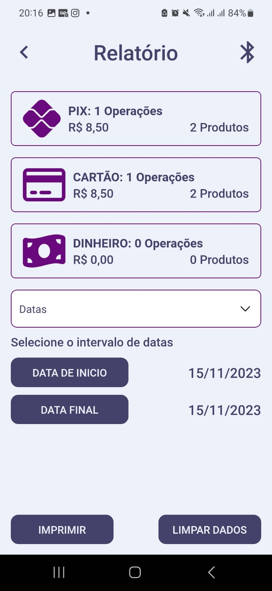

# Esfa CX

> Externato São Francisto de Assis Caixa é um APP que simula um programa de caixa de supermercado, com seleção de produtos, forma de pagamento e impressão de um cupom (nesse caso, não fiscal).

OBS:

* A impressora é conectada via Bluetooth
* Para login, o usuário precisa de permissão (verificada na API)
* Os produtos são carregados da API
* As compras são armazenadas localmente

## Executando o projeto

1. Instlar as dependências com `yarn`
2. Adicionar as envs necessárias no arquivo `.env`:
```
GOOGLE_FIREBASE_AUTH_CLIENTID=<id_do_firebase>
GOOGLE_FIREBASE_AUTH_APP_ID=<firebase_app_id>
GOOGLE_FIREBASE_AUTH_PROJECT_ID=<gcp_project_id>

ESFA_API_URL=<api_url>
ESFA_API_TOKEN=<api_key_url>
```
PS: Para verificar as keys do google:
```
https://console.firebase.google.com/u/0/project/<project-id>/settings/general/<app>?hl=pt
```
3. Executar em um terminal o metro com `yarn start`
4. Instalar em um dispositivo android ou em um emulador android com `yarn android`

## Previews

### Login
;

### Home
;

### Confirmar Produtos
;

### Checkout
;

### Cupom Impresso
;

### Perfil
;

### Reimpressão de Compra
;

### Reimpressão de Compra
;